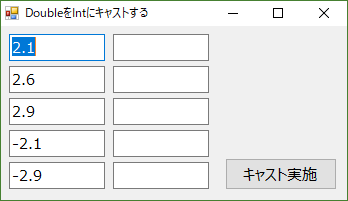

# 概要
ITSS準拠の研修カリキュラム「プログラミングの基礎（B121）」のうち、「文法：式と演算子」の実習として、文字列から数値への変換処理について実際のプログラムで体験します。
各課題は別々のプログラム（別プロジェクト）として作成してください。また、作成するアプリケーションはWindows Formを想定しています。
ここで掲示しているプログラムは正解サンプルです。実際の課題実施に際しては、新人にはゼロからプログラムを作ってもらいます。

# 課題

## 事前準備
Visual StudioでC#のWindows Formプロジェクトを作成してください。


## 課題1: 

### 新人用説明文
フォームにテキストボックス2個とボタンを貼り、片方のテキストボックスに入力した小数をボタン押下で整数に変換してみてください。下図の例ではテキストボックスを5個にして、5個の数字を一度に変換できるようにしています。



ここで利用する変換は「キャスト（cast）」と呼ばれるもので、下記の手順で変換処理を書いてみましょう。

1. テキストボックスに入力された小数を、「double.Parse(TextBox1.Text);」のようなParseメソッドでdouble型に変換する。
1. double型の変数に対して、下記のような方法で整数への強制変換を行う。

    ```cs
    int result = (int) doubleValue;
    ```

変換には下記のような数値を用いて、キャストによる変換でどのような事が起きるかを確認してみてください。

- 2.1～2.9のような数値を変換 …… 小数を整数に変換することで、切り上げ、切り捨て、四捨五入のいずれが行われるか。
- マイナスの値を変換 …… マイナスの小数についても同様にどのような処理が行われるか。

### 講師用補足
ここではキャストの働きを確認します。Parse()メソッドはstring型だけを対象にする上、変換先のデータ型にそぐわない文字列の場合はエラーになりました。キャストの場合は、強制変換とも言えるような変換を行うことができますが、この例の場合、小数点以下はすべて切り捨てられ

- 2.1 → 2
- 2.9 → 2
- -2.5 → 2

のように、すべて2になります。


## 課題2: 

### 新人用説明文
次に、Parseメソッドの動きを確認します。課題1のプロジェクトをコピーして新しいプロジェクトを作成し、下記の仕様にそったプログラムに変更してください。

- テキストボックスに入力された小数文字列を、int.Parse() メソッドで整数に変換する。

プログラムができたら、課題1と同じような小数を入力し、intに変換してみてください。どのような結果になるかと、Parseメソッドが利用できないケースはどのような場合かについて検討してみてください。

### 講師用補足
この例ですが、「System.FormatException: '入力文字列の形式が正しくありません。'」が発生します。
Parseメソッドは、Parseという言葉の意味通り「構文に沿っているかどうかを確認する」という意味合いが入っており、変換対象、この場合は整数型のデータにそぐわない情報が引き渡されるとエラーを返します。
このサンプルでは「エラーがでる。こういう場合はParseは使えない」という事が判ればOKです。


---
# サンプルソース概略

## CastDoubleToInt

##　ConvertToInt
